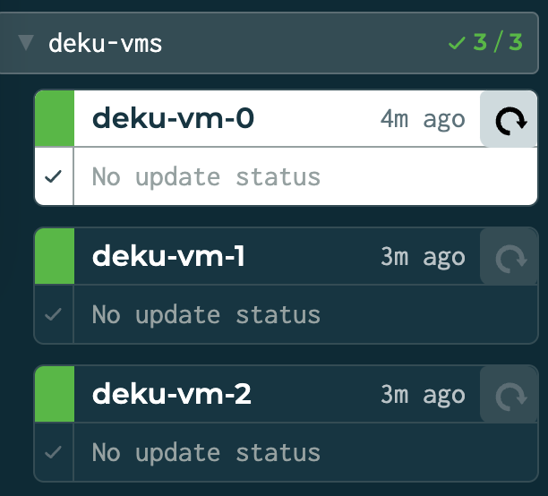
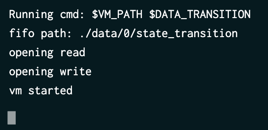
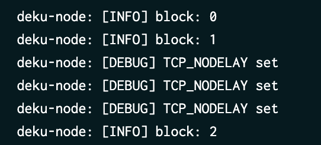
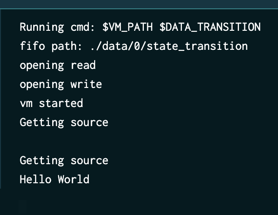

# Create your first JS Deku dApp

In this tutorial, we will use the `deku_js_interop` to create our first dApp using Typescript.

## Prerequisites

1. Create the folder of your choice (examples/cookie-game) for us, run `npm init`
2. Run `npm install typescript`, to create a `package.json` file
3. Install `deku_js_interop` to use it as a dependency, with `npm install "file:path/to/sdks/deku_js_interop"`
4. Create `index.ts` file
5. Create a deku-wallet if you don't already have one:
```shell script
$ deku-cli create-wallet
```

This will generate a `tz1xxxx.tzsidewallet` file, which I rename to `wallet.json` for the example.

_Optional_
1. create a `tsconfig.json` file to use some useful compiler options (see [our own tsconfig.json](examples/tutorial/tsconfig.json) for example)
2. Modify `package.json` to add `"build": "tsc --p tsconfig.json"` in the `scripts` section

## Hello world

### Import deku_js_interop

In your `index.ts` file you must import `deku_js_interop`, as following:

```typescript
import { main, get, set, transaction } from "deku_js_interop"
```

### transition function

Your business will be done in a `transition` function, you can create a basic one, like the following:

```typescript
const transition = (tx: transaction) => {
}
```

The `tx` which is a `transaction` will allow you to retrieve and save the state of your application.
Before using it, let's write the `main` function, with an initial empty state:
```typescript
main({ my_state: "" }, transition);
```

The first argument of the `main` function is your initial state. It must be a `JSON` object with the `tz1xxx` address as key
The second, is your `transition` function which will update your state.

### hello world

#### Build it

Let's modity our empty initial state with a basic "hello world":

1. Get the `tx.source` where the state is saved.
2. Parse the `source`
3. Since the state is an empty string, let's just append `Hello world` to it

Your `transition` function should look like this:

```typescript
const transition = (tx: transaction) => {
    // get the current value of `state` field defined in `main` function
    let source_value = JSON.parse(get("my_state"));
    // set the new value to `Hello world!`
    source_value = "Hello World!";
    // save the new state
    set("my_state", source_value);
}
```

Run `npm run build` to build your VM.

### Test it

You can easily test it with the following command:
```shell script
$ deku-cli create-mock-transaction wallet.json '""' node examples/tutorial/index.js
```

Please note this is a `mocked` transaction, it is not executed on Deku.

#### Run it on a Deku cluster

On Deku side, we use `tilt` to run a working `deku_cluster` with our VM.
You can do it by running the following command, in the main Deku directory:

```shell script
$ tilt up -- --mode=local --vm="node examples/tutorial/index.js"
```

Wait for all the `vms` to be up and ready:


With a detail like the following for each VM:


And with an up and ready Deku (nodes exchanging blocks):


#### Call your VM transaction

We will run the following command to execute our application:

```shell script
$ deku-cli create-custom-transaction data/0 wallet.json '""'

(node:65197) [DEP0005] DeprecationWarning: Buffer() is deprecated due to security and usability issues. Please use the Buffer.alloc(), Buffer.allocUnsafe(), or Buffer.from() methods instead.
(Use `node --trace-deprecation ...` to show where the warning was created)
operation.hash: 0f119e93991bf55ccbcaa60333774430df0d1592c5c93b21733f85e7747a7a54
close
```

And you should see the state being updated on VM side on tilt UI:


# Voilà

## Operation

Now we would like to give the new value of the state, we will simply write it in the last argument of `deku-cli create-custom-transaction`:

```shell script
$ deku-cli create-custom-transaction data/0 wallet.json '"Hello world!"'
```

And use it within our `index.ts`:
```typescript
const transition = (tx: transaction) => {
    console.log("Getting source");
    let source_value = JSON.parse(get("my_state"));
    console.log("Current value: " + source_value);
    // tx.operation is the last argument of `deku-cli` command line
    source_value = tx.operation;
    console.log("New value: " + source_value);
    set("my_state", source_value);
}
```

Let's now call it once again, with something else:
```shell script
$ deku-cli create-custom-transaction data/0 wallet.json '"Something else"'
```

And check on tilt, the VM state updating:
```
Getting source
Current value:
New value: Hello world!
Getting source
Current value: Hello world!
New value: Something else
```

For more complex examples, you can have a look at [counter](../../examples/ts-counter/example.ts) or at [cookie-game](../../examples/cookie-game/index.ts).

You are now able to modify your state from the outside world, let's do this with the HTTP APIs!

## From the outside world

You can go further, and create an application using your state. For a complex example, you can have a look at [decookies](https://github.com/marigold-dev/decookies), which is a basic front UI using [cookie-game](../../examples/cookie-game/index.ts) state.

Your outside application will have to interact with the Deku VM. To do so, I will explain the different steps.

I will not focus about the front part, the only things that matters are the useful functions to:
1. retrieve the state
2. retrieve the height
3. create and submit the operation

### 1. Retrieve the actual state

On Deku side, there is the `POST /vm-state` endpoint:

```typescript
const get_actual_state = async () => {
  const state_request = await fetch("http://localhost:4440/vm-state",
    {
      method: "POST",
      body: JSON.stringify(null)
    });
  const state_response = await state_request.json();
  console.log(JSON.stringify(state_response));
  //should print
  //{"state":[["state","cookie"]]}
  return state_response;
}
```

The state is a list of pairs. For example, in the `decookies` project, the initia state is:
```json
{
    "tz1VULT8pu1NoWs7YPFWuvXSg3JSdGq55TXc":
    {
        cookie_baker_state:
        {
            number_of_cookie: 0,
            number_of_cursor: 0.,
            number_of_grandma: 0.,
            number_of_farm: 0.,
            number_of_free_cursor: 0,
            number_of_free_grandma: 0,
            number_of_free_farm: 0,
            cursor_cost: initial_cursor_cost,
            grandma_cost: initial_grandma_cost,
            farm_cost: initial_farm_cost,
            cursor_cps: 0,
            grandma_cps: 0,
            farm_cps: 0,
            total_cps: 0
        }
    }
}
```

Which is received as following from the `/vm-state` endoint:

```json
{
  "state": [
    [
      "tz1VULT8pu1NoWs7YPFWuvXSg3JSdGq55TXc",
      {
        "cookie_baker_state": {
          "number_of_cookie": 0,
          "number_of_cursor": 0,
          "number_of_grandma": 0,
          "number_of_farm": 0,
          "number_of_free_cursor": 0,
          "number_of_free_grandma": 0,
          "number_of_free_farm": 0,
          "cursor_cost": 15,
          "grandma_cost": 100,
          "farm_cost": 1100,
          "cursor_cps": 0,
          "grandma_cps": 0,
          "farm_cps": 0,
          "total_cps": 0
        }
      }
    ]
  ]
}
```

### 2. Retrieve the actual height

In order to submit an operation, you must retrieve the actual `block-level`, this can be done with:
```typescript
const request_block_level = async () => {
  const block_request = await fetch("http://localhost:4440/block-level",
    {
      method: "POST",
      body: JSON.stringify(null)
    });
  const block_response = await block_request.json();
  return block_response.level;
}
```

which response is:
```json
{ "level": 42 }
```

We will need it in the next section.

### 3. Call `/gossip-user-operation` endpoint


#### Create the payload

This endpoint must be call to submit your operation to Deku.
Here is an explained example of the body you should provide:

```json
{
  "user_operation": {
    "hash": "ac0a84c1f606dcaabbc4a16fdf83714c62bac34c9d56f55e32dc7fbe14270c83",
    "key": "edpkv5a9ZSXJDErjRC2N8hR4GbimYsQ45q646tsuBvCTDiVnpKU3Q9",
    "signature": "edsigtqWYS46iHWGJpgTgaG5KjsXmFoxoG9RvM1AWKk6wQm8PrN38YraPzjTqpMKXj1MQLKWrBXJ2Jknab3nzi65CdRg2fBBF6N",
    "nonce": 857314109,
    "block_height": 933,
    "data": {
      "hash": "d6d9a446af772944a4f477b29044d5c7acd2181e7eb4493342217fe788d23416",
      "source": "tz1VULT8pu1NoWs7YPFWuvXSg3JSdGq55TXc",
      "initial_operation": [
        "Vm_transaction",
        {
          "payload": "Hello World!"
        }
      ]
    }
  }
}
```

We will start explaining by the `data` nested object:
- `initial_operation`: is always a polymorphic array, whose first element is the string `"Vm_transaction"` and second element, a JSON record whre `payload` is the payload needed by our application, the last argument of the previous `deku-cli create-custom-transaction` command
```typescript
const initial_operation = ["Vm_transaction", {
    "Hello World!"
}];
```
- `source`: the `tz1xxxxx` address of the `wallet` submitting the operation
- `hash`: needs two different step:
```typescript
//1. stringify an array containing the tz1xxx address and the previously created initial_operation
const json_to_hash = JSON.stringify(["tz1xxxx", initial_operation]);
//2. 1. convert the previous string to hex
//2. 2. encode the hex using blake2b algorithm on base 58
//2. 3. decode the obtained string
//2. 4. slice it to remove prefix and suffix
const inner_hash = b58decode(encodeExpr(stringToHex(json_to_hash))).slice(4, -2);
```
- Finally, create the `data` JSON representation containing these three elements:
```typescript
const data = {
    hash: inner_hash, //⚠ respect the order of fields in the object for serialization
    source: "tz1xxx",
    initial_operation: initial_operation,
}
```

Now, let's move the other fields:
- `block_height` is the value you got on [step 2](./hello_world.md#2-retrieve-the-actual-height)
- `nonce` can basically be a random between 0 and the maximum Integer value
- `signature` can be obtained by using [taquito `signer`](https://tezostaquito.io/docs/inmemory_signer/) for the record type containing `nonce`, `block_height` and `data` previously created:

```typescript
const full_payload = JSON.stringify([ //FIXME: useless?
    nonce,
    block_height,
    data
]);
// Signer from taquito
const signature = await signer.sign(stringToHex(full_payload)).then((val) => val.prefixSig);
```
- And finally `hash`, is like before, the `hash` of the whole record (full_payload in this example):
```typescript
const hash = b58decode(encodeExpr(stringToHex(full_payload))).slice(4, -2);
```

#### Call the endpoint

Now we have the whole payload, we just need to wrap it in the revelant record to match the structure:
```typescript
// wrap the operation in a record type
const operation = {
      hash,
      key,
      signature,
      nonce,
      block_height,
      data
    }
// create a `user_operation` based on the previously created operation
const packet =
    { user_operation: operation };
// call the endpoint with the payload!
const result = await fetch("http://localhost:4440/gossip-user-operation",
    {
    method: "POST",
    body: JSON.stringify(packet)
    });
```

# 🎉 Voilà!! 👏 🥳

You just successfully updated the vm-state of you Deku dapp from a front-web!